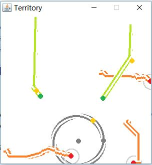
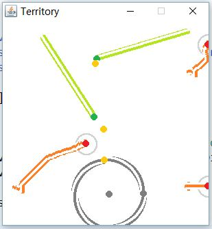
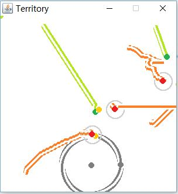
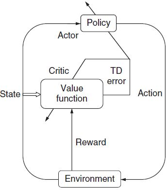
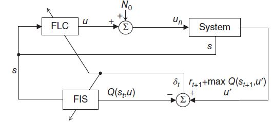
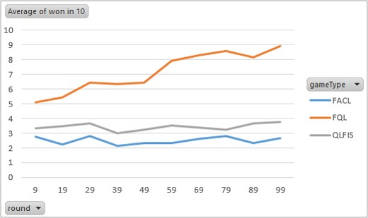

## Multi-Agent Reinforcement Learning in Strategy Games

### Fuzzy Q-Learning
    
#### Description of the game

- Given territory area, there are two types of players: invader and defender
- The game has invaders who follow the NE strategy
- Defenders to learn how to intercept as early in the game as possible
- All agents have the same speed. Control variable is the defenders' direction in the next move
- Q-table sharing between all defenders at the end of each round

#### The fuzzy inference system

$n$ continuous inputs (angle of the invader and of the territory relative to the defender) are defuzzified into $M$ fuzzy rules. Output is a single numerical number representing the direction of the defender's next move. The rules $l (l = 1, \cdots, M)$ can be described as:

$R^l : \text{IF } x_1 \text{ is } F_1^l, \cdots, \text{ and } x_n \text{ is } F_n^l \text{ THEN } u = c^l$

where $\vec{x} = (x_1, \cdots, x_n)$ are inputs, $F_i^l$ are the fuzzy sets corresponding to each input, $u^l$ are the infered output from each rule, $c^l$ are the center of each rule.

Using _product inference engine_ and weighted average defuzzification, the final output can be written as:

$$U(\vec{x}) = \cfrac{\sum_{l=1}^M \Big( \left( \Pi_{i=1}^n \mu^{F_i^l}(x_i) \right) \cdot c^l \Big)}{\sum_{l=1}^M \left( \Pi_{i=1}^n \mu^{F_i^l}(x_i) \right)} = \sum_{l=1}^M \Phi^l c^l$$

where $\mu^{F_i^l}$ is the membership function of fuzzy set $F_i^l$.

#### Q-learning

After fuzzification, the two continuous inputs are discretized into 8 discrete values each. The 64 combinations of the input pairs become 64 states of the Q-learning system. 

In this case the choice of inference engine is Mamdani system, where the output action is a set of eight discrete numbers (corresponding to eight possible directions of the defender). The Mamdani system then uses a defuzzification module (in my case a linear function with $\Phi_l$ as the weight for each rule) to convert the discrete set back into continuous space.  

In the actor-critic algorithm (see next chapter), the Takagi-Sugeno inference system is used where the output is directly in continuous space.

$q(l,a)$ records the probability of choosing action $a$ under rule $l$. $Q* = max_a \sum_l^M \Phi_l q(l,a)$ is used as the TD target.

Value error $VE = \sum (\text{TD target}-\hat{Q})^2$

and 

$q_{t+1}(l,a) = q_{t} + \text{const} \frac{\partial VE}{\partial q} = q_{t} + \eta (\text{TD target}-\hat{Q}) \frac{\partial Q}{\partial q} $  
$\quad\quad\quad\quad = q_{t} + \eta \epsilon \frac{\partial Q}{\partial q} = q_{t} + \eta \epsilon \Phi_t^l$

is the update equation. 

Using the FIS parameters:

Action space $A=\{ a_1,a_2,\cdots,a_m \}$,

Final output (action): $U_t(\vec{x}_t) = \sum_{l-1}^M \Phi_t^l a_t^l$

where actions are selected according to the $\epsilon$-greedy algorithm to ensure exploration:

$a^l = \begin{cases}
	\text{random action from A} & \quad Prob(\epsilon) \\
	argmax_{a \in A}(q(l,a)) & \quad Prob(1-\epsilon)
\end{cases}$

And value of the action is $Q_t(\vec{x}_t) = \sum_{l-1}^M \Phi_t^l q_t(l,a_t^l)$

$Q_t^{*}(\vec{x}_t) = \sum_{l-1}^M \Phi_t^l max_{a \in A} q_t(l,a)$

TD-error: $\tilde{\epsilon}_{t+1} = r_{t+1} + \gamma Q_t^{*}(\vec{x}_{t+1}) - Q_t(\vec{x}_t)$

Parameter update: $q_{t+1}(l,a_t^l) = q_t(l,a_t^l) + \eta \tilde{\epsilon}_{t+1} \Phi_t^l$

Pseudo code:

>Initialize $q(\cdot) = 0$ and $Q(\cdot) = 0$  
>for Each time step do:  
&nbsp;&nbsp;Choose action for each rule based on $\epsilon$ at time t;  
&nbsp;&nbsp;Compute global continuous action $U_t(\vec{x}_t)$;  
&nbsp;&nbsp;Compute $Q_t(\vec{x}_t)$;  
&nbsp;&nbsp;Take $U_t(\vec{x}_t)$ and run the game;  
&nbsp;&nbsp;Obtain reward $r_{t+1}$ and new inputs $\vec{x}_{t+1}$;  
&nbsp;&nbsp;Compute $Q_t^{*}(\vec{x}_{t+1})$;  
&nbsp;&nbsp;Compute TD error $\tilde{\epsilon}_{t+1}$;  
&nbsp;&nbsp;Update $q_{t+1}(l,a_t^l), \quad l = 1,\cdots, M$;  
end for

Since the actual reward can only be obtained at the end of each episode, a reward-shaping is used to estimate the reward in each time step. In my case it is simply the difference between invader angle and territory angle - it is assumed that a better direction for the defender is to be in between invader and territory, therefore a better angle difference would be 180 degrees.

#### Results

Positions for two invaders and three defenders are randomly set within a range. Territory is fixed. The invaders will calculate their NE strategy in the beginning of the game and adhere to the strategy. Defenders have to learn their strategies to intercept. All agents have speed of 1 and can turn in any direction at any time step.

The game runs for n=100 episodes, and at the end of each episode, the q-tables are shared between all defenders with a simple weighting function. 

>round 9 won: 3 out of the last 10 games  
round 19 won: 14 out of the last 10 games  
round 29 won: 15 out of the last 10 games  
round 39 won: 10 out of the last 10 games  
round 49 won: 9 out of the last 10 games  
round 59 won: 17 out of the last 10 games  
round 69 won: 13 out of the last 10 games  
round 79 won: 12 out of the last 10 games  
round 89 won: 14 out of the last 10 games  
round 99 won: 19 out of the last 10 games

red dots are defenders, green dots are invaders. the lines are the trajectories. 

first round: random initialization:

third round: defenders which are initialized to positions which are similar to the rounds before can already successfully intercept. However more exploration is needed to learn a better strategy with different positions:

60th round: all defender agents have a higher rate of interception:

### Fuzzy Actor-Critic Learning

Second algorithm tested is the actor-critic learning. 

#### Policy gradient

$s_t$: state in time step t

$a_t$: action in time step t

$\theta$: policy parameters, to be learned

$H$: horizon, maximum time steps

$N$: number of episodes

$\tau=(s_0,a_0,s_1,a_1,\cdots,s_H,a_H)$ trajectory

$r(s_{i,t},a_{i,t})$: the ith trajectory，reward at ith step

$p(s_{t+1}|s_t,a_t)$：transition probability

$p_{\theta}(\tau)$: probability of selecting trajectory tau under policy theta

$J(\theta)$: reward of policy theta

objective：maximize $J(\theta)=\sum_t^H r(s_{t},a_{t})=\int p_{\theta}(\tau) r(\tau) d\tau$

update equation: $\theta = \theta + \alpha \cfrac{\partial J(\theta)}{\partial \theta}$

we need to get: $\triangledown_{\theta} J(\theta) = \cfrac{\partial J(\theta)}{\partial \theta}$

to avoid vanishing/exploding gradient, use log: $\triangledown_{x} log(f(x))=\cfrac{1}{f(x)}\triangledown_x f(x)$:

$\triangledown_{\theta} J(\theta) = \int \triangledown_\theta p_\theta(\tau) r(\tau) d\tau$  
$\quad\quad\quad\quad = \int p_\theta(\tau) \triangledown_\theta log(p_\theta(\tau)) r(\tau) d\tau$  
$\quad\quad\quad\quad = \mathbb{E}_{\tau \sim p_\theta(\tau)}\big[ \triangledown_\theta log(p_\theta(\tau)) r(\tau) \big]$

where

$p_\theta(\tau)=p(s_0)\prod_{t=1}^H p_\theta(a_t|s_t)p(s_{t+1}|s_t,a_t)$  
$\implies log(p_\theta(\tau)) = log(p(s_0)) + \sum_t^H log(p_\theta(a_t|s_t)) + \sum_t^H log(p(s_{t+1}|s_t,a_t))$  
$\implies \triangledown_\theta log(p_\theta(\tau)) =\sum_t^H \triangledown_\theta log(p_\theta(a_t|s_t))$  
$\implies \triangledown_{\theta} J(\theta) = \cfrac{1}{N} \sum_i^N \Big( \sum_{t=1}^H \triangledown_\theta log(p_\theta(a_t|s_t)) \sum_{t'=t}^H r(s_{i,t},a_{i,t}) \Big)$  

Since we have added a white noise around the output action $u_t$, $p_\theta(a_t|s_t)=mathcal{N}(f(s_t),\sigma)$

based on the pdf of gaussian distribution we get:

$p_\theta(a_t|s_t)=\cfrac{1}{\sqrt{2\pi \sigma}}exp\big( -\cfrac{1}{2} \cfrac{(x-f_\theta(s_t))^2}{\sigma} \big)$  
$\implies log(p_\theta(a_t|s_t)) = -\cfrac{1}{2}log(2\pi\sigma) -\cfrac{1}{2} \cfrac{(x-f_\theta(s_t))^2}{\sigma}$  
$\implies \triangledown_\theta log(p_\theta(a_t|s_t)) = \cfrac{x-f_\theta(s_t)}{\sigma}\triangledown_\theta f_\theta(s_t)$

In the case of actor-critic learning, actor is using policy gradient with reward from the critic (which uses Q-learning):

$Q(s_t,a_t)=\sum_{t'=t}^H \mathbb{E}_{p_\theta} \big[ r(s_{t'},a_{t'})|s_t,a_t \big]$ is the TRUE EXPECTED reward-TO-GO, or total reward from taking a_t in state s_t.

To reduce variance, baseline V is subtracted from TD target:

$V(s_t)=\mathbb{E}_{a_t \sim p_\theta(a_t|s_t)} \big[ Q(s_t,a_t) \big] = \sum_{t'=t}^H \mathbb{E}_{p_\theta}\big[ r(s_{t'},a_{t'}|s_t) \big]$ is the TRUE EXPECTED state-value. or total reward from $s_t$.

$\implies \triangledown_\theta J(\theta) = \cfrac{1}{N} \sum_i^N \sum_t^H \triangledown_\theta log(p_\theta(a_{i,t}|s_{i,t})) \big( Q(s_{i,t},a_{i,t}) - V(s_{i,t}) \big)$

Advantage: $A(s_t,a_t) = Q(s_{t},a_{t}) - V(s_{t})$,

and

$Q(s_t,a_t)=r(s_{t+1},a_{t+1}) + \mathbb{E}_{s_{t+1} \sim p(s_{t+1}|s_t,a_t)} \big[ V(s_{t+1}) \big] \approx r(s_{t+1},a_{t+1}) + V(s_{t+1})$  
$\implies A(s_t,a_t) \approx r(s_{t+1},a_{t+1}) + V(s_{t+1}) - V(s_{t})$  
$\implies \triangledown_\theta J(\theta) = \cfrac{1}{N} \sum_i^N \sum_t^H \triangledown_\theta log(p_\theta(a_{i,t}|s_{i,t})) A(s_{i,t},a_{i,t})$

if to add discount factor $\gamma$ to the future terms, we get the same formulation as in my experimental case.

#### Actor-Critic Learning

In my case, using FIS parameters in the actor-critic:

**Actor**

$\cfrac{\partial V_t}{\partial w_t^l} = \triangledown_w log\big(p_w(s_t,u'_t)\big) A(s_t,u'_t)$

where $p_w(s_t,u'_t) = \mathcal{N}(u_t, \sigma)$, 

$A(s_t,u'_t))=r_{t+1} + \gamma \hat{V}_{t+1} - \hat{V}_t = \Delta$,

and $\cfrac{\partial u_t}{\partial w_t^l}=\phi_t^l$, 

$\implies \cfrac{\partial V_t}{\partial w_t^l} = \Delta \cfrac{\hat{u}_t-u_t}{\sigma} \phi_t^l$

where $\hat{u}_t = normal(u_t, \sigma)$ is the final output action.

The FIS engine in the actor module is a Sugeno type inference system

$u_t = \sum_{l=1}^M \Phi^l w_t^l$

whose linear parameters $w_l$ are to be learned:

$w_{t+1}^l = w_{t}^l + \beta \text{sign } \big\{ \Delta \big(\cfrac{u'_t-u_t}{\sigma} \big) \big\} \cfrac{\partial u}{\partial w^l}$

TD error $\Delta = r_{t+1} + \gamma \hat{V}_{t+1} - \hat{V}_t$，

$\cfrac{\partial u}{\partial w^l} = \Phi_t^l$,  
$\beta \in (0,1)$ is the actor's learning rate，$u'_t$ is the actual output action, $u_t$ is the calculated output from actor, $\sigma$ is the variance of the white noise added, $\gamma$ is the discount factor.

**Critic**

State value $V_t = E\Big\{ \sum_{k=0}^{\infty} \gamma^k r_{t+k+1} \Big\}$

or $V_t = r_{t+1} + \gamma V_{t+1}$

$\hat{V}_t = \sum_{l=1}^M \Phi^l c_t^l$

update: $c_{t+1}^l = c_t^l + \alpha \Delta \cfrac{\partial \hat{V}}{\partial c^l}$

where $\cfrac{\partial \hat{V}}{\partial c^l} = \Phi^l$

$\alpha \in (0,1)$ is the critic's learning rate.

>Initialize $\hat{V} = 0, c^l = 0, w^l = 0 \text{ for } l = 1,\cdots, M$,  
$\quad\alpha_a, \alpha_c, \sigma, \gamma$.  
for Each time step do:  
&nbsp;&nbsp;&nbsp;&nbsp;Obtain inputs $\vec{x}_t$;  
&nbsp;&nbsp;&nbsp;&nbsp;Calculate output of actor:$u_t = \sum_{l=1}^M \Phi^l w_t^l$;  
&nbsp;&nbsp;&nbsp;&nbsp;Calculate output of critic: $\hat{V}_t = \sum_{l=1}^M \Phi^l c_t^l$;  
&nbsp;&nbsp;&nbsp;&nbsp;Run the game for current time step;  
&nbsp;&nbsp;&nbsp;&nbsp;Obtain reward $r_{t+1}$ and new inputs $\vec{x}_{t+1}$;  
&nbsp;&nbsp;&nbsp;&nbsp;Calculate $\hat{V}_{t+1}$ from $\hat{V}_t = \sum_{l=1}^M \Phi^l c_t^l$;  
&nbsp;&nbsp;&nbsp;&nbsp;Calculate $\Delta = r_{t+1} + \gamma \hat{V}_{t+1} - \hat{V}_t$;  
&nbsp;&nbsp;&nbsp;&nbsp;Update $c_{t+1}^l=c_t^l+\alpha \Delta \Phi_t^l$,  
$\quad w_{t+1}^l=w_t^l+\beta \text{sign } \Big\{ \Delta \big( \cfrac{u'_t-u_t}{\sigma} \big) \Big\} \Phi_t^l$.  
end for.

### QLFIS (Q($\lambda$)-learning fuzzy inference system

Another algorithm tested is the QLFIS algorithm, which consists of a fuzzy logic controller and an estimator. The FLC is a TD(lambda)-learning algorithm, whereas the estimator simply uses Q-learning.

#### Q($\lambda$)-learning

**the forward view**

An attempt to generalize:

Monte Carlo (TD(lambda=1)): TD target $V^*=R_t=\sum_t'=t^T R_{t+1}$

TD(0) (TD(lambda=0)): TD target $V^*=R_{t+1}+\hat{V}(s_{t+1})$, with discount factor $\gamma$：$V^*=R_{t+1}+\gamma\hat{V}(s_{s+1})$

into: $V_{t,\theta}^{(n)} = \sum_{i=1}^n r_{t+i} + \hat{V}_{t+n}$, with discount factor $\gamma$：$V_{t,\theta}^{(n)} = \sum_{i=1}^n \gamma^{i-1} r_{t+i} + \gamma^{n} \hat{V}_{t+n}$.

update: $\theta=\theta+\alpha\cfrac{\partial \hat{V}(s)}{\partial \theta}=\theta+\alpha(V^*-\hat{V}(s))\cfrac{\partial f_\theta(s)}{\partial \theta}=\theta+\alpha\Delta\cfrac{\partial f_\theta(s)}{\partial \theta}$,

In TD(lambda) algorithm, the weighted effect of all n-step rewards can be described using the lambda-return algorithm:

$V_t^{\lambda}=\sum_{n=1}^{\infty} (1-\lambda) \lambda^{n-1} V_{t,\theta}^{(n)}$

with terminal state T:

$V_t^{\lambda}=\sum_{n=1}^{T-t-1} (1-\lambda) \lambda^{n-1} V_{t,\theta}^{(n)} + \lambda^{T-t-1} V_{t,\theta}^{(T-t)}$

with value of terminal states as 0:

$V_{t,\theta}^{(T-t)} = \sum_{i=1}^{T-t} r_{t+i} + \hat{V}_T = \sum_{t'=t}^{T} r_{t'} = V_{t}$

$\implies V_t^{\lambda}=\sum_{n=1}^{T-t-1} (1-\lambda) \lambda^{n-1} V_{t,\theta}^{(n)} + \lambda^{T-t-1} V_{t}$

**backward view**

Use eligibility trace to record the time each state is visited and the weight of the update:

eligibility $e_t$ substitutes for: $\alpha \cfrac{\partial f_\theta}{\partial \theta}$:

$\theta=\theta + \Delta e_t$

Define backward view's time step t's gradient as: $dV_t^{TD}(s_t) = \Delta e_t = \Delta (\gamma \lambda e_{t-1} + \alpha \cfrac{\partial f_\theta(s_t)}{\partial \theta})$

And define forward view's time step t's gradient as: $dV_t^{\lambda}(s_t)=\alpha\big( V_t^{\lambda}(s_t) - V_t(s_t) \big)  \cfrac{\partial f_\theta(s_t)}{\partial \theta}$

where $V_i(s_j)$ denotes estimated state value timestep i after j steps.

It can be proven that the forward view is equivalent to the backward view: 

$\sum_{t=0}^{T-1} dV_t^{TD}(s_t) = \sum_{t=0}^{T-1} dV_t^{\lambda}(s_t)I_{s=s_t}$, where $I=1 \text{ if } s=s_t \text{ else } 0$

1.. LHS: 

redefine eligibility trace

$e_t = \begin{cases}
\gamma \lambda e_{t-1} + 0 \quad\quad, s\neq s_t \\
\gamma \lambda e_{t-1} + \alpha \cfrac{\partial f_\theta(s_t)}{\partial \theta} \quad, s=s_t
\end{cases}$

$\implies \begin{cases}
e_t = \gamma \lambda e_{t-1} + I_{ss_t} \alpha \cfrac{\partial f_\theta(s_t)}{\partial \theta} \\
e_{t-1} = \gamma \lambda e_{t-2} + I_{ss_{t-1}} \alpha \cfrac{\partial f_\theta(s_{t-1})}{\partial \theta} \\
\cdots
\end{cases}$

$\implies e_t = (\gamma \lambda)^{t-1}e_1 + \sum_{i=0}^{t-1}(\gamma\lambda)^i I_{ss_i} \alpha \cfrac{\partial f_\theta(s_i)}{\partial \theta}$

where $e_1=0$.

$I_{ss_t} = 1 \text{ if } s=s_t \text{ else } 0$

$\implies e_t =\sum_{i=0}^{t-1}(\gamma\lambda)^{i} \cdot I_{ss_i} \cdot \alpha \cfrac{\partial f_\theta(s_i)}{\partial \theta} = \sum_{i=0}^{t} (\gamma \lambda)^{t-i} \cdot I_{ss_i} \cdot \alpha \cfrac{\partial f_\theta(s_i)}{\partial \theta}$

we have:

$dV^{TD}(s_t) = \Delta_t e_t = \sum_{i=0}^{t} (\gamma \lambda)^{t-i} I_{ss_i} \cdot \alpha \Delta_t \cfrac{\partial f_\theta(s_i)}{\partial \theta}$

which can be rewritten as:

$\sum_{t=0}^{T-1} dV_t^{TD}(s_t) =  \sum_{t=0}^{T-1}  \alpha \Delta_t \sum_{i=0}^{t} (\gamma \lambda)^{t-i} I_{ss_i} \cdot \cfrac{\partial f_\theta(s_i)}{\partial \theta} = \sum_{t=0}^{T-1} \alpha I_{ss_t} \cfrac{\partial f_\theta(s_i)}{\partial \theta} \sum_{i=t}^{T-1}(\gamma\lambda)^{i-t} \Delta_i$.

As an example, using T=3 to write out the above equation:

$\sum_{t=0}^2 \alpha \Delta_t \sum_{i=0}^t (\gamma\lambda)^{t-i} I_{ss_i} \cfrac{\partial f_\theta(s_i)}{\partial \theta}$  
$\quad\quad = \alpha \Delta_0 (\gamma\lambda)^0 I_{ss_0}\cfrac{\partial f_\theta(s_0)}{\partial \theta}$  
$\quad\quad = \alpha \Delta_1 (\gamma\lambda)^1 I_{ss_0}\cfrac{\partial f_\theta(s_0)}{\partial \theta} + \alpha \Delta_1 (\gamma\lambda)^0 I_{ss_1}\cfrac{\partial f_\theta(s_1)}{\partial \theta}$  
$\quad\quad = \alpha \Delta_2 (\gamma\lambda)^2 I_{ss_0}\cfrac{\partial f_\theta(s_0)}{\partial \theta} + \alpha \Delta_2 (\gamma\lambda)^1 I_{ss_1}\cfrac{\partial f_\theta(s_1)}{\partial \theta} + \alpha \Delta_2 (\gamma\lambda)^0 I_{ss_2}\cfrac{\partial f_\theta(s_2)}{\partial \theta} $  

Rearange the columns into:

$\sum_{t=0}^2 \alpha \Delta_t \sum_{i=0}^t (\gamma\lambda)^{t-i} I_{ss_i} \cfrac{\partial f_\theta(s_i)}{\partial \theta}$  
$\quad\quad = \alpha \Delta_0 (\gamma\lambda)^0 I_{ss_0}\cfrac{\partial f_\theta(s_0)}{\partial \theta} + \alpha \Delta_1 (\gamma\lambda)^1 I_{ss_0}\cfrac{\partial f_\theta(s_0)}{\partial \theta} + \alpha \Delta_2 (\gamma\lambda)^2 I_{ss_0}\cfrac{\partial f_\theta(s_0)}{\partial \theta}$  
$\quad\quad =  \alpha \Delta_1 (\gamma\lambda)^0 I_{ss_1}\cfrac{\partial f_\theta(s_1)}{\partial \theta} +  \alpha \Delta_2 (\gamma\lambda)^1 I_{ss_1}\cfrac{\partial f_\theta(s_1)}{\partial \theta}$  
$\quad\quad =  \alpha \Delta_2 (\gamma\lambda)^0 I_{ss_2}\cfrac{\partial f_\theta(s_2)}{\partial \theta}$  
$\quad\quad = \sum_{t=0}^{T-1=2} \alpha I_{ss_t}\cfrac{\partial f_\theta(s_t)}{\partial \theta} \sum_{i=t}^{T-1=2} (\gamma\lambda)^{i-t} \Delta_i$

2.. RHS:

$dV_t^{\lambda}(s_t) = d'V_t^{\lambda}(s_t) \cdot \alpha \cfrac{\partial f_\theta(s_t)}{\partial \theta} \implies d'V_t^{\lambda}(s_t) = \big( V_t^{\lambda} - V_t(s_t) \big)$ 

calculate:

$d'V_t^{\lambda}(s_t) = -V_t(s_t)$  
$\quad\quad\quad\quad\quad\quad + (1-\lambda)\lambda^0\big[ r_{t+1}+\gamma V_t(s_{t+1}) \big]$  
$\quad\quad\quad\quad\quad\quad + (1-\lambda)\lambda^1\big[ r_{t+1}+ \gamma r_{t+2} + \gamma^2 V_t(s_{t+2}) \big]$  
$\quad\quad\quad\quad\quad\quad + (1-\lambda)\lambda^2\big[ r_{t+1}+ \gamma r_{t+2}+ \gamma^2 r_{t+3} + \gamma^3 V_t(s_{t+3}) \big]$
$\quad\quad\quad\quad\quad\quad \cdots$  

every column in the bracket can be rearanged, using $r_{t+1}$ as an example:

$\sum_{i=0}^\infty (1-\lambda)\lambda^i r_{t+1} = r_{t+1}$: according to the lambda-return algorithm, the sum of this probability is 1. Same goes for e.g. $r_{t+2}$:

$\sum_{i=0}^\infty (1-\lambda)\lambda^{i+1}\cdot \gamma r_{t+2} = (\gamma \lambda)^1 r_{t+2}$。

therefore:

$d'V_t^{\lambda}(s_t) = -V_t(s_t)$  
$\quad\quad\quad\quad\quad\quad + (\gamma \lambda)^0 \big[ r_{t+1} + \gamma V_t(s_{t+1}) - \gamma \lambda V_t(s_{t+1}) \big]$  
$\quad\quad\quad\quad\quad\quad + (\gamma \lambda)^1 \big[ r_{t+2} + \gamma V_t(s_{t+2}) - \gamma \lambda V_t(s_{t+2}) \big]$  
$\quad\quad\quad\quad\quad\quad + (\gamma \lambda)^2 \big[ r_{t+3} + \gamma V_t(s_{t+3}) - \gamma \lambda V_t(s_{t+3}) \big]$  
$\quad\quad\quad\quad\quad\quad \cdots$  
$\quad\quad\quad\quad\quad = -(\gamma \lambda)^0 V_t(s_t)$  
$\quad\quad\quad\quad\quad\quad + (\gamma \lambda)^0 \big[ r_{t+1} + \gamma V_t(s_{t+1}) \big] - (\gamma \lambda)^1 V_t(s_{t+1})$  
$\quad\quad\quad\quad\quad\quad + (\gamma \lambda)^1 \big[ r_{t+2} + \gamma V_t(s_{t+2}) \big] - (\gamma \lambda)^2 V_t(s_{t+2})$  
$\quad\quad\quad\quad\quad\quad + (\gamma \lambda)^2 \big[ r_{t+3} + \gamma V_t(s_{t+3}) \big] - (\gamma \lambda)^3 V_t(s_{t+3})$  
$\quad\quad\quad\quad\quad\quad \cdots$  
$\quad\quad\quad\quad\quad = (\gamma \lambda)^0 \big[ r_{t+1} + \gamma V_t(s_{t+1}) -V_t(s_t) \big]$  
$\quad\quad\quad\quad\quad\quad + (\gamma \lambda)^1 \big[ r_{t+2} + \gamma V_t(s_{t+2}) -V_t(s_{t+1})\big]$  
$\quad\quad\quad\quad\quad\quad + (\gamma \lambda)^2 \big[ r_{t+3} + \gamma V_t(s_{t+3}) -V_t(s_{t+2})\big]$  
$\quad\quad\quad\quad\quad\quad \cdots$  

in the offline algorithm (reward at the end of an episode): $ r_{t+i} + \gamma V_t(s_{t+i}) = G_t$, therefore:

$d'V_t^{\lambda}(s_t) =\sum_{i=t}^\infty (\gamma\lambda)^{i-t} \Delta_i = \sum_{i=t}^{T-1}(\gamma\lambda)^{i-t} \Delta_i$

Unfortunately in an online algorithm, the value estimation means the above equation is only an approximation.

The sum of all time steps is the same as the backward view:

$\sum_{t=0}^{T-1} dV_t^{\lambda}(s_t) I_{ss_t} = \sum_{t=0}^{T-1} \alpha I_{ss_t} \cfrac{\partial f_\theta(s_t)}{\partial \theta} \sum_{i=t}^{T-1} (\gamma\lambda)^{i-t} \Delta_i$

#### QLFIS

Is based on [Q(lambda)-learning fuzzy logic controller for a multi-robot system - _S. Desouky and H. Schwartz_](https://ieeexplore.ieee.org/stamp/stamp.jsp?tp=&arnumber=5641791).

The FLC and the estimator (FIS) have independent membership functions and parameters to learn (e.g. in the case of gaussian membership function, the mean and variance of the MF is also learned). 

$\alpha$ as FLC's learning rate, $\beta$ as estimator FIS's learning rate, membership degrees are $\Phi_{FLC}^l$ and $\Phi_{FIS}^l$, $w^l$ is the FLC's output parameters, $c^l$ the FIS's output parameters, $\Delta$ is TD error,  $u_t$ the calculated output action, $u'_t$ is the actual output action with white noise, $Q(s,a)$ is the state action value, r is reward，$e_t$ is eligibility trace.

Since the gaussian MF parameters also need to be learned, we need to get the gradient of the MF with reward to the mean and the variance. 

TD error $\Delta_t = r_{t+1} + \gamma max_{u'} Q(s_{t+1},u') - Q(s_t,u_t)$

$e_t = \gamma \lambda e_{t-1} + \cfrac{\partial Q_t(s_t,a_t)}{\partial \xi}$

$\xi_{FLC} = [w \; m_{FLC} \; \Sigma_{FLC}]^T, \xi_{FIS} = [c \; m_{FIS} \; \Sigma_{FIS}]^T$

input update equation: $\xi_{FLC}(t+1) = \xi_{FLC}(t) + \alpha \Delta_t \big\{ \cfrac{\partial u}{\partial \xi_{FLC}} \big( \cfrac{u_n-u}{\sigma_n} \big) \big\}$

$\xi_{FIS}(t+1) = \xi_{FIS}(t) + \beta \Delta_t \big\{ \gamma \lambda e_{t-1} + \cfrac{\partial Q_t(s_t,u_t)}{\partial \xi_{FIS}} \big\}$

where

$\cfrac{\partial Q(s,u)}{\xi_{FIS}} = \begin{bmatrix} 
    \cfrac{\partial Q(s,u)}{\partial c^l} \\
    \cfrac{\partial Q(s,u)}{\partial m_i^l} \\
    \cfrac{\partial Q(s,u)}{\partial \Sigma_i^l}
\end{bmatrix} = \begin{bmatrix} 
    \Phi_l \\
    \cfrac{(c^l-Q(s,u))}{\sum_l\Phi_l} \; \Phi_l \; \cfrac{2(x_i-m_i^l)}{(\Sigma_i^l)} \\
    \cfrac{(c^l-Q(s,u))}{\sum_l\Phi_l} \; \Phi_l \; \cfrac{2(x_i-m_i^l)^2}{(\Sigma_i^l)^{2}}
\end{bmatrix}$

$\cfrac{\partial u}{\partial \xi_{FLC}} = \begin{bmatrix} 
    \cfrac{\partial u}{\partial w^l} \\
    \cfrac{\partial u}{\partial m_i^l} \\
    \cfrac{\partial u}{\partial \Sigma_i^l}
\end{bmatrix} = \begin{bmatrix}
    \Phi_l \\
    \cfrac{(w^l-u)}{\sum_l\Phi_l} \; \Phi_l \; \cfrac{2(x_i-m_i^l)}{(\Sigma_i^l)} \\
    \cfrac{(w^l-u)}{\sum_l\Phi_l} \; \Phi_l \; \cfrac{2(x_i-m_i^l)^2}{(\Sigma_i^l)^{2}}
\end{bmatrix}$.

Using a simple example with 2 inputs (i = {1,2}) and two rules (l = {1,2}), gaussian MF:

output $u=\cfrac{\mu_1(x_1)\mu_1(x_2)w_1 + \mu_2(x_1)\mu_2(x_2)w_2}{\mu_1(x_1)\mu_1(x_2) + \mu_2(x_1)\mu_2(x_2)}$,

MF: $\mu_l(x_i)=exp[-(\cfrac{x_i-m_l^i}{\sigma_l^i})^2]$,

$\cfrac{\partial u}{\partial m_1^1}=\cfrac{\partial u}{\partial \mu_1(x_1)} \cdot \cfrac{\partial \mu_1(x_1)}{\partial m_1^1}$,

where $\cfrac{\partial \mu_1(x_1)}{\partial m_1^1}=\mu_1(x_1) \cdot \cfrac{2(x_1-m_1^1)}{(\sigma_1^1)^2}$,

because of the chain rule:

$\cfrac{\partial \frac{f(x)}{g(x)}}{\partial x}=\cfrac{g(x) \frac{\partial f(x)}{\partial x} - f(x) \frac{\partial g(x)}{\partial x}}{g^2(x)}$

$\implies \cfrac{\partial u}{\partial m_1^1} =  \cfrac{2(x_1-m_1^1)}{(\sigma_1^1)^2} \cdot \cfrac{\big( \mu_1(x_1)\mu_1(x_2) \big) \cdot \big( w_1\mu_2(x_1)\mu_2(x_2) - w_2\mu_2(x_1)\mu_2(x_2) \big) }{\big( \sum_l^{M=2} \mu_l(x_1)\mu_l(x_2) \big)^2}$

$\quad \quad \quad \quad = \cfrac{2(x_1-m_1^1)}{(\sigma_1^1)^2} \cdot \cfrac{\mu_1(x_1)\mu_1(x_2)}{\sum_l^{M=2} \mu_l(x_1)\mu_l(x_2)}$

$\quad \quad \quad \quad \quad \quad  \cdot \cfrac{\big( w_1 \mu_1(x_1)\mu_1(x_2) + w_1 \mu_2(x_1)\mu_2(x_2) \big) - \big( w_1 \mu_1(x_1)\mu_1(x_2) + w_2 \mu_2(x_1)\mu_2(x_2) \big)}{\sum_l^{M=2} \mu_l(x_1)\mu_l(x_2)}$

$\quad \quad \quad \quad = \cfrac{2(x_1-m_1^1)}{(\sigma_1^1)^2} \cdot \Phi_l \cdot (w_1 - u)$.

$\Phi_l = \Pi_{i=1}^{n=2} \; exp \Big( -\big( \cfrac{x_i-w_i^l}{\sigma_i^l} \big)^2 \Big)$

and standardized: $\bar{\Phi}_l = \cfrac{\Phi_l}{\sum_{l=1}^M \Phi_l}$.

>Initialize:  
>&nbsp;&nbsp;&nbsp;&nbsp;$\xi_{FLC}^l=[w^l,m_{FLC}^l,\Sigma_{FLC}^l]$,  
>&nbsp;&nbsp;&nbsp;&nbsp;$\xi_{FIS}^l=[c^l,m_{FIS}^l,\Sigma_{FIS}^l]$,  
>&nbsp;&nbsp;&nbsp;&nbsp;$e,\gamma,\lambda,\sigma_n,\alpha,\beta, \Phi_{FLC}^l, \Phi_{FIS}^l$;  
>for Each time step do:  
>&nbsp;&nbsp;&nbsp;&nbsp;$u_t= \sum_l^M \Phi_{FLC,t}^l w_t^l$;  
>&nbsp;&nbsp;&nbsp;&nbsp;$u'_t = \mathcal{N}(u_t, \sigma_n)$;  
>&nbsp;&nbsp;&nbsp;&nbsp;$Q(s_t,u_t) = \sum_l^M \Phi_{FIS, t}^l c_t^l$;  
>&nbsp;&nbsp;&nbsp;&nbsp;play game;  
>&nbsp;&nbsp;&nbsp;&nbsp;$\Delta_t = r_{t+1} + \gamma max_{u'} Q(s_{t+1},u'_t) - Q(s_t,u_t)$;  
>&nbsp;&nbsp;&nbsp;&nbsp;$e_t =  \gamma \lambda e_{t-1} + \frac{\partial Q(s_t,u_t)}{\partial \xi_{FIS}}$;  
>&nbsp;&nbsp;&nbsp;&nbsp;$\xi_{FLC} += \alpha \Delta_t \big\{ \frac{\partial u}{\partial \xi_{FLC}} \big( \frac{u'_t-u_t}{\sigma_n} \big) \big\}$;  
>&nbsp;&nbsp;&nbsp;&nbsp;$\xi_{FIS} += \beta \Delta_t \big\{ \gamma \lambda e_{t-1} + \frac{\partial Q(s_t,u_t)}{\partial \xi_{FIS}} \big\}$;  
>end for  

### Comparison of the three algorithms:

Simulation:
- 1 invader playing NE strategy, 2 defenders learning best interception strategy
- 20 rounds played, each with 100 episodes
- Average interception distance and average games won are recorded
- Defenders share parameters at the end of each episode. Importance of each update is weighed by the interception distance.
- Reward-shaping is done in every time step. The reward is based on difference between invader angle and territory angle.
- At the end of each round the parameter tables are reset.
- Fuzzy Q-learning (FQL), fuzzy actor-critic (FACL), Q(lambda)-learning with FIS parameter learning (QLFIS) are tested

Result:
- Except for FQL, the other two algorithms did not learn. 
- The FACL has very high variance in both number of winning games and interception distance.
- The QLFIS algorithm updates very slowly due to increased number of parameters to be learned in the FIS systems. 

Potential improvements: 
- Other (better) ways of reward shaping
- Other parameter sharing algorithms at the end of the episode
- Other RL algorithms e.g. PPO

